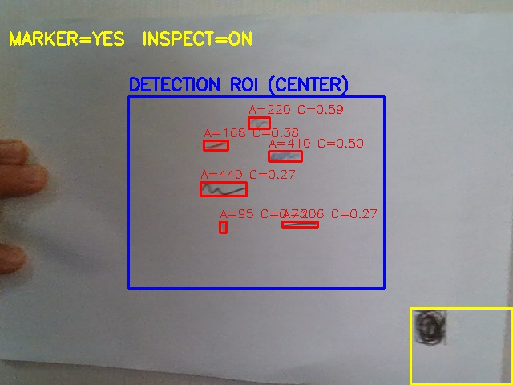

# Defect Detector


## 🔹 프로젝트 구조

```
DefectDetector/
    src/
        main.cpp
        detector.cpp
        detector.h
    CMakeLists.txt
    README.md
```
---
## 🔹 실행법 (for Local PC)

### 👉 Requirements

- OpenCV 4.12+  
- CMake 3.16+  

### 👉 Build

```
mkdir build
cd build
cmake ..
cmake --build . --config Release
```

### 👉 Run (for Windows)
```
DefectDetector.exe
```
---

-

## 🔹 결과

```
ㆍ Frame Size   :  640 × 480
ㆍ Latency      :  약 50ms/frame
ㆍ Throughput   :  약 20 FPS (EMA)
```

예시:



---
📄 [Work Details](https://portfolio-unoh.site/cproject)  
🛠 Developed by 06unoh 